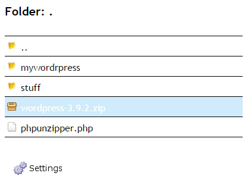
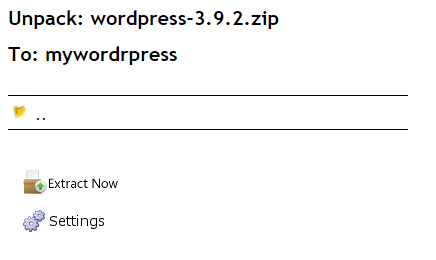

The project
=========
This script gives a possibility to uncompress zip file in chosen location, using only a web browser.

Project was intended for more efficient web software upload. Instead of sending 1000 files through FTP, it's much more efficient to compress them into one zip file and put such compressed file on FTP, then uncompress it remotely.

Features
========

* Show files in current folder
* Change current folder
* Select current zip file
* Unpack previously selected zip file in current folder

Screenshots
===========

